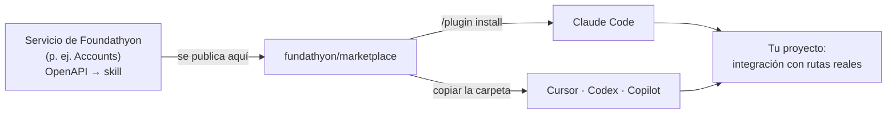
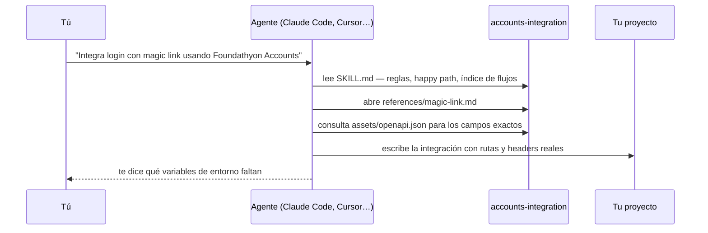

# Foundathyon marketplace

Foundathyon ofrece los módulos que toda startup acaba construyendo igual —
robustos, listos, para que tu equipo funde la empresa en lugar de reconstruir lo
de siempre. Hoy, **Accounts**: autenticación y cuentas de usuario. Los servicios
que vengan entrarán aquí igual.

Este marketplace es el **conjunto de skills y herramientas de AI** de Foundathyon
para tu agente de código. Instalas lo de un servicio en **Claude Code**,
**Cursor**, **Codex** o **GitHub Copilot**, y a partir de ahí el asistente lo
integra con sus rutas, headers y formato de respuesta **reales** — sin
inventarlos y sin que tengas que pegarle la documentación en cada prompt.

## Qué hay hoy

| Servicio | Plugin | Skill | Qué te da | Versión |
| --- | --- | --- | --- | --- |
| **Accounts** — cuentas y login | `accounts` | [`accounts-integration`](plugins/accounts/skills/accounts-integration/SKILL.md) | Signup, signin, refresh token, OAuth, magic link, código de acceso por correo, usuarios de prueba (testers), webhooks, roles y behaviors, integrados en tu código | 0.3.0 |

Cada servicio nuevo de Foundathyon entra aquí como un plugin más y se instala
igual. [Cómo recibirlo cuando salga](#cuando-foundathyon-publique-un-servicio-nuevo).

**Un plugin, una skill, diecisiete guías.** El plugin `accounts` es lo que
instalas. Contiene una sola skill, `accounts-integration`, y no diecisiete, a
propósito: el agente carga un índice pequeño (`SKILL.md`, con las reglas que
nunca debe violar y el happy path) y después **solo la guía del flujo que le
pides**. Cada guía es un archivo de `references/`:

| Guía | Cubre |
| --- | --- |
| `quickstart` | Flujo mínimo: app → signup → signin |
| `setup` | Docker, variables de entorno y `BASE_URL` |
| `api-keys-and-auth` | Tipos de auth y matriz por endpoint |
| `response-format` | Envelope JSON success/error y `trace_id` |
| `auth-flows` | Árbol de decisión para elegir el flujo |
| `email-auth` | Signup, signin, activación, reset, login unificado |
| `tokens` | Refresh, validación, revocación, `jwt/info` |
| `oauth` | OAuth web redirect y SDK nativo (`id_token`) |
| `magic-link` | Autenticación passwordless por enlace |
| `email-code` | Autenticación passwordless por código (email OTP): entrar o crear la cuenta con un código |
| `behaviors` | Configuración por app que cambia los flujos |
| `users` | CRUD de usuario, metadata y cambio de email |
| `roles-policies` | RBAC: roles y políticas |
| `webhooks` | Eventos HTTP hacia tu backend |
| `endpoints-reference` | Tabla completa de endpoints |
| `error-scopes` | Errores por `scope` |
| `sdk-patterns` | Patrones frontend/backend |

Y el contrato HTTP completo, machine-readable, en `assets/openapi.json`, para
que el agente consulte los campos exactos de cada body.

## Cómo funciona



Una **skill** es una carpeta con un `SKILL.md`, según el estándar abierto
[Agent Skills](https://agentskills.io), que leen todos esos agentes. Al
arrancar, el agente solo carga el nombre y la descripción de cada skill
instalada; cuando le pides algo que encaja, abre el `SKILL.md` y, de ahí, solo
la guía del flujo que necesita.



## Instalar por primera vez

### Claude Code

Un solo comando, escrito **dentro de Claude Code** (no en la terminal).
Requiere Claude Code 2.1.275 o posterior:

```
/plugin install accounts --marketplace fundathyon/marketplace
```

En versiones anteriores, en dos pasos — el marketplace se añade una sola vez y
sirve para todos los servicios de Foundathyon:

```
/plugin marketplace add fundathyon/marketplace
/plugin install accounts@foundathyon
```

Al instalar eliges el alcance:

| Alcance | Para quién | Dónde queda |
| --- | --- | --- |
| **user** | tú, en todos tus proyectos | tu configuración de usuario |
| **project** | todo el equipo del repositorio | `.claude/settings.json` del repo, commiteado |
| **local** | solo tú, solo en este repositorio | `.claude/settings.local.json` |

Comprueba que está: `/plugin list`.

Para que un equipo lo tenga sin instalar nada a mano, declara el marketplace en
el `.claude/settings.json` del repositorio. Claude Code lo añade cuando cada
persona confía en la carpeta, y le muestra el comando para instalar el plugin:

```json
{
  "extraKnownMarketplaces": {
    "foundathyon": {
      "source": { "source": "github", "repo": "fundathyon/marketplace" }
    }
  },
  "enabledPlugins": ["accounts@foundathyon"]
}
```

### Cursor

Cursor no instala plugins de Claude Code, pero lee el mismo formato Agent
Skills. Copia la skill a `~/.agents/skills/` — la misma carpeta que leen Codex y
Copilot, así que una copia sirve para los tres:

```sh
mkdir -p ~/.agents/skills && curl -fsSL https://docs.foundathyon.com/downloads/accounts-integration.tar.gz \
  | tar -xz -C ~/.agents/skills
```

Para un solo proyecto, usa `.agents/skills/` dentro del repositorio: la skill se
commitea con el código y la tienen tus compañeros. Cursor también lee
`.cursor/skills/` y, por compatibilidad, `.claude/skills/`.

Comprueba que está: `ls ~/.agents/skills/accounts-integration/SKILL.md`.

### Codex

El mismo comando que Cursor. Codex busca skills en `.agents/skills` desde el
directorio actual hasta la raíz del repositorio, y en `~/.agents/skills` para tu
usuario:

```sh
mkdir -p ~/.agents/skills && curl -fsSL https://docs.foundathyon.com/downloads/accounts-integration.tar.gz \
  | tar -xz -C ~/.agents/skills
```

### GitHub Copilot

Copilot (CLI, VS Code y el agente de código) lee `.agents/skills/` en el
repositorio y `~/.agents/skills/` para tu usuario. El mismo comando de arriba.

### Sin `curl`: clonando el repositorio

Si prefieres ver lo que instalas, clona y copia la carpeta de la skill:

```sh
git clone https://github.com/fundathyon/marketplace
cp -r marketplace/plugins/accounts/skills/accounts-integration ~/.agents/skills/
```

## Usar

Pídele la integración y **nombra la skill y el flujo**. Nombrar el flujo lleva
al agente directo a la guía correcta:

```
Integra login con email, signup y refresh token usando Foundathyon Accounts.
BASE_URL en ACCOUNTS_BASE_URL, publishable key en env.
Usa la skill accounts-integration.
```

```
Añade login passwordless con magic link a este proyecto Next.js, reutilizando
la pantalla de login que ya existe. Usa la skill accounts-integration.
```

```
Implementa el receptor de webhooks de Foundathyon Accounts en este backend
Express: verifica la firma y procesa user.signup. Usa la skill accounts-integration.
```

```
Revisa cómo este código llama a Foundathyon Accounts y corrige lo que no
coincida con la skill accounts-integration.
```

Define las credenciales en tu proyecto, con la secret key **solo en el backend**
— la skill se lo indica al agente, y tus prompts también deberían:

```sh
ACCOUNTS_BASE_URL=https://foundathyon.com/services/accounts
ACCOUNTS_PUBLISHABLE_KEY=pk_live_...
ACCOUNTS_SECRET_KEY=sk_live_...        # solo backend
```

Con la skill instalada, el agente lee `SKILL.md` al activarla y las guías según
el flujo; no inventa rutas ni headers; distingue `/v1/apps` (sin `/api`) de las
rutas de auth `/api/v1/...`; y mantiene la secret key fuera del frontend.

## Actualizar

La skill se genera desde el OpenAPI de Accounts. Una skill vieja genera código
contra rutas que ya no existen, así que conviene no quedarse con una copia
antigua.

**Claude Code**

```
/plugin update accounts
```

> [!IMPORTANT]
> Claude Code trae el auto-update **desactivado** por defecto en marketplaces
> de terceros como este. Actívalo una vez en `/plugin` → **Marketplaces** →
> **foundathyon** → **Enable auto-update**, y no tendrás que volver a pensarlo.

**Cursor, Codex y Copilot** — relanza el mismo `curl` de la instalación (o
`git pull` en el clon y vuelve a copiar la carpeta); sobrescribe la anterior.

### Cuando Foundathyon publique un servicio nuevo

Entra en este mismo marketplace como otro plugin. Imaginemos uno hipotético al
que llamaremos `crons` — el nombre es inventado, solo para el ejemplo:

**Claude Code** — refresca el catálogo e instálalo. El marketplace ya lo
tienes añadido:

```
/plugin marketplace update foundathyon
/plugin install crons@foundathyon
```

**Cursor, Codex y Copilot** — copia la skill nueva a la misma carpeta que la de
Accounts, desde el clon o con el `curl` que publique su documentación:

```sh
git -C marketplace pull
cp -r marketplace/plugins/crons/skills/crons-integration ~/.agents/skills/
```

Instalas solo los servicios que usas. Cada uno tiene su propia versión y sus
propias skills y herramientas; el agente solo carga las que tienes instaladas.

## Eliminar

**Claude Code**

```
/plugin uninstall accounts@foundathyon     # quita el plugin
/plugin disable accounts@foundathyon       # lo deja instalado, pero apagado
/plugin marketplace remove foundathyon     # quita el marketplace y todos sus plugins
```

**Cursor, Codex y Copilot** — borra la carpeta, y la copia por proyecto si la
hiciste:

```sh
rm -rf ~/.agents/skills/accounts-integration
```

En Codex también puedes apagarla sin borrarla, con una entrada
`[[skills.config]]` en `~/.codex/config.toml`.

## Estructura

```text
.claude-plugin/
  marketplace.json                    el catálogo: qué plugins hay y dónde
plugins/
  accounts/                           un plugin = un servicio de Foundathyon
    plugin.json                       manifiesto del plugin
    .claude-plugin/plugin.json        el mismo manifiesto, donde lo lee Claude Code
    skills/
      accounts-integration/           una skill = una carpeta con SKILL.md
        SKILL.md                      reglas, happy path e índice; lo primero que lee el agente
        references/                   una guía por flujo (las 16 de la tabla)
        assets/openapi.json           el contrato HTTP, machine-readable
```

Tres niveles:

- **El marketplace** es el catálogo. Solo `marketplace.json`: no contiene código,
  apunta a los plugins.
- **El plugin** es la unidad que instala un agente. Uno por servicio.
- **La skill** es lo que el agente lee: `SKILL.md`, `references/`, `assets/`.

Con un segundo servicio — el `crons` inventado del ejemplo — la estructura
crece hacia los lados, sin tocar lo que ya tienes:

```text
plugins/
  accounts/
    skills/accounts-integration/…
  crons/                              ← nombre inventado, solo para el ejemplo
    plugin.json
    .claude-plugin/plugin.json
    skills/crons-integration/
      SKILL.md
      references/
      assets/openapi.json
```

## Preguntas frecuentes

**¿La skill llama a la API del servicio?** No. Enseña al agente a integrarla;
la llama el código que el agente escribe en tu proyecto. Cuando un servicio
tenga servidor MCP, entrará en el mismo plugin y entonces el agente sí podrá
llamarlo directamente.

**¿Necesito Claude Code?** No. Cualquier agente que lea Agent Skills — Cursor,
Codex, Copilot, Gemini CLI, Kiro y muchos más — usa la misma carpeta. Claude
Code es el único que la instala con un comando y la actualiza con otro.

**¿Uso varios agentes?** Instala el plugin en Claude Code y copia la skill a
`~/.agents/skills/`; con eso quedan cubiertos todos.

**¿Es seguro instalarlo?** Una skill son documentos: Markdown y un OpenAPI. No
ejecuta nada en tu máquina. Cada cambio pasa por CI: el validador del estándar,
el de Claude Code y el de este repositorio.

**¿Dónde está la documentación para humanos?** El mismo contenido, en
[docs.foundathyon.com](https://docs.foundathyon.com/es/plataforma/ai-skills).

---

¿Mantienes este marketplace? Las reglas para añadir un servicio, versionar y
validar están en [AGENTS.md](AGENTS.md).
