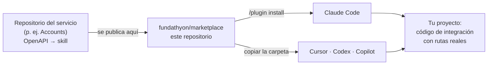
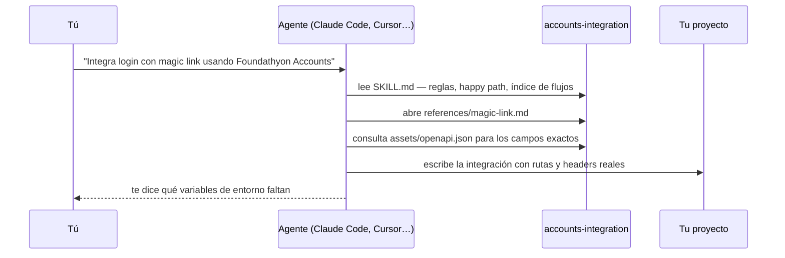
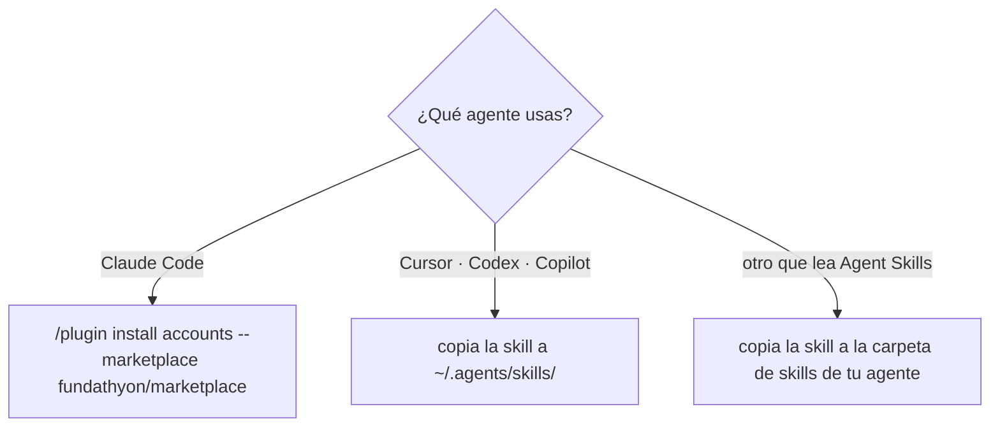

# Foundathyon marketplace

Skills de integración de Foundathyon para tu agente de código. Instalas la skill
de un servicio en **Claude Code**, **Cursor**, **Codex** o **GitHub Copilot**, y
a partir de ahí el asistente escribe la integración con las rutas, headers y
formato de respuesta **reales** de ese servicio — sin inventarlos, sin que
tengas que pegarle la documentación en cada prompt.

Hoy publica un servicio, **Accounts**. Cada servicio nuevo de Foundathyon
entrará aquí como un plugin más, y se instalará igual.

## Cómo funciona



Una **skill** es una carpeta con un `SKILL.md` en la raíz, según el estándar
abierto [Agent Skills](https://agentskills.io), que leen todos esos agentes.
Al arrancar, el agente solo carga el nombre y la descripción de cada skill que
tiene instalada; cuando le pides algo que encaja, abre el `SKILL.md`, y de ahí
solo la guía del flujo que necesita. Así puede tener muchas skills sin gastar
contexto hasta que hacen falta.



## Qué tienes hoy: Accounts

| Plugin | Skill | Qué es | Versión |
| --- | --- | --- | --- |
| `accounts` | [`accounts-integration`](plugins/accounts/skills/accounts-integration/SKILL.md) | Toda la integración de Foundathyon Accounts: signup, signin, refresh token, OAuth, magic link, webhooks, roles y behaviors | 0.1.0 |

**Un plugin, una skill, dieciséis guías.** El plugin `accounts` es lo que
instalas. Contiene una sola skill, `accounts-integration`, y no dieciséis, a
propósito: el agente carga un índice pequeño (`SKILL.md`, con las reglas que
nunca debe violar y el happy path) y después **solo la guía del flujo que le
pides**. Cada guía es un archivo de `references/`:

| Guía | Cubre |
| --- | --- |
| `quickstart` | Flujo mínimo: app → signup → signin |
| `setup` | Docker, variables de entorno y `BASE_URL` |
| `api-keys-and-auth` | Tipos de auth y matriz por endpoint |
| `response-format` | Envelope JSON success/error y `trace_id` |
| `auth-flows` | Árbol de decisión para elegir el flujo |
| `email-auth` | Signup, signin, activación, reset, login unificado |
| `tokens` | Refresh, validación, revocación, `jwt/info` |
| `oauth` | OAuth web redirect y SDK nativo (`id_token`) |
| `magic-link` | Autenticación passwordless |
| `behaviors` | Configuración por app que cambia los flujos |
| `users` | CRUD de usuario, metadata y cambio de email |
| `roles-policies` | RBAC: roles y políticas |
| `webhooks` | Eventos HTTP hacia tu backend |
| `endpoints-reference` | Tabla completa de endpoints |
| `error-scopes` | Errores por `scope` |
| `sdk-patterns` | Patrones frontend/backend |

Y el contrato HTTP completo, machine-readable, en `assets/openapi.json`
(Swagger 2.0), para que el agente consulte los campos exactos de cada body.

## Instalar



### Claude Code — como plugin

Un solo comando, escrito **dentro de Claude Code** (no en la terminal):

```
/plugin install accounts --marketplace fundathyon/marketplace
```

Requiere Claude Code 2.1.275 o posterior. En versiones anteriores, en dos
pasos — el marketplace se añade una sola vez y sirve para todos los servicios:

```
/plugin marketplace add fundathyon/marketplace
/plugin install accounts@foundathyon
```

Al instalar eliges el alcance:

| Alcance | Para quién | Dónde queda |
| --- | --- | --- |
| **user** | tú, en todos tus proyectos | tu configuración de usuario |
| **project** | todo el equipo del repositorio | `.claude/settings.json` del repo, commiteado |
| **local** | solo tú, solo en este repositorio | `.claude/settings.local.json` |

Para que un equipo lo tenga sin instalar nada a mano, declara el marketplace en
el `.claude/settings.json` del repositorio; Claude Code lo añade al confiar en
la carpeta y muestra el comando de instalación del plugin:

```json
{
  "extraKnownMarketplaces": {
    "foundathyon": {
      "source": { "source": "github", "repo": "fundathyon/marketplace" }
    }
  },
  "enabledPlugins": ["accounts@foundathyon"]
}
```

### Cursor, Codex y Copilot — copiando la carpeta

Estos agentes no instalan plugins de Claude Code, pero leen el mismo formato
Agent Skills. Los tres leen `~/.agents/skills/`, así que **una sola copia cubre
los tres**:

```sh
git clone https://github.com/fundathyon/marketplace
mkdir -p ~/.agents/skills
cp -r marketplace/plugins/accounts/skills/accounts-integration ~/.agents/skills/
```

Sin clonar, desde la documentación de Accounts, que sirve el mismo bundle:

```sh
mkdir -p ~/.agents/skills && curl -fsSL https://docs.foundathyon.com/downloads/accounts-integration.tar.gz \
  | tar -xz -C ~/.agents/skills
```

Rutas por agente, si prefieres ser explícito:

| Agente | En un repositorio | Para tu usuario |
| --- | --- | --- |
| Cursor, Codex, Copilot | `.agents/skills/<skill>` | `~/.agents/skills/<skill>` |
| Cursor (ruta propia) | `.cursor/skills/<skill>` | `~/.cursor/skills/<skill>` |
| Claude Code, sin plugin | `.claude/skills/<skill>` | `~/.claude/skills/<skill>` |

Cursor además lee `.claude/skills/` y `.codex/skills/` por compatibilidad.
Instalada **dentro de un repositorio**, la skill se commitea con el código: la
tienen tus compañeros y también los agentes que corren en la nube.

## Usar

Pídele la integración y **nombra la skill y el flujo**. Nombrar el flujo lleva
al agente directo a la guía correcta:

```
Integra login con email, signup y refresh token usando Foundathyon Accounts.
BASE_URL en ACCOUNTS_BASE_URL, publishable key en env.
Usa la skill accounts-integration.
```

```
Añade login passwordless con magic link a este proyecto Next.js, reutilizando
la pantalla de login que ya existe. Usa la skill accounts-integration.
```

```
Implementa el receptor de webhooks de Foundathyon Accounts en este backend
Express: verifica la firma y procesa user.signup. Usa la skill accounts-integration.
```

```
Revisa cómo este código llama a Foundathyon Accounts y corrige lo que no
coincida con la skill accounts-integration.
```

Define las credenciales en tu proyecto, con la secret key **solo en el backend**
— la skill se lo indica al agente, y tus prompts también deberían:

```sh
ACCOUNTS_BASE_URL=https://foundathyon.com/services/accounts
ACCOUNTS_PUBLISHABLE_KEY=pk_live_...
ACCOUNTS_SECRET_KEY=sk_live_...        # solo backend
```

Lo que el agente hace con la skill instalada:

- Lee `SKILL.md` al activarla y las guías **según el flujo** que le pidas.
- No inventa rutas ni headers: respeta la matriz de autenticación y el formato
  de respuesta.
- Distingue `/v1/apps` (sin `/api`) de las rutas de auth `/api/v1/...`.
- Mantiene la secret key fuera del frontend.

## Mantenerlo al día

La skill se genera desde el OpenAPI de Accounts. Una skill vieja genera código
contra rutas que ya no existen, así que conviene no quedarse con una copia
antigua:

- **Claude Code:** `/plugin update accounts`.
- **Cursor, Codex, Copilot:** vuelve a copiar la carpeta o relanza el `curl`;
  sobrescribe la anterior.

> [!IMPORTANT]
> Claude Code trae el auto-update **desactivado** por defecto en marketplaces
> de terceros como este. Actívalo en `/plugin` → **Marketplaces** →
> **Enable auto-update**, o actualiza a mano.

## Estructura del repositorio

```text
.claude-plugin/
  marketplace.json                    el catálogo: qué plugins hay y dónde
plugins/
  accounts/                           un plugin = un servicio de Foundathyon
    plugin.json                       manifiesto Agent Plugins 1.0
    .claude-plugin/plugin.json        el mismo manifiesto, donde lo lee Claude Code
    skills/
      accounts-integration/           una skill = una carpeta con SKILL.md
        SKILL.md                      reglas, happy path e índice; lo primero que lee el agente
        references/                   una guía por flujo (las 16 de la tabla)
        assets/openapi.json           el contrato HTTP, machine-readable
```

Tres niveles, y conviene no confundirlos:

- **El marketplace** es el catálogo. Solo `marketplace.json`: no contiene código,
  apunta a los plugins.
- **El plugin** es la unidad que instala un agente. Uno por servicio. Puede
  llevar skills, comandos, hooks y servidores MCP.
- **La skill** es lo que el agente lee: `SKILL.md`, `references/`, `assets/`.

### Cuando haya más servicios

Imaginemos que Foundathyon publica, además de Accounts, un servicio hipotético
de notificaciones. Entraría como **otro plugin**, con su propia skill, sin
tocar el de Accounts:

```text
plugins/
  accounts/
    skills/accounts-integration/…
  notifications/                      ← hipotético, solo para ilustrar
    plugin.json
    .claude-plugin/plugin.json
    skills/notifications-integration/
      SKILL.md
      references/
      assets/openapi.json
```

Y se instalaría igual — el marketplace ya lo tienes añadido:

```
/plugin install notifications@foundathyon
```

Cada servicio mantiene su propia versión. Instalas solo los que usas, y el
agente carga solo las skills que tiene instaladas.

### Cuando un servicio tenga MCP

Un plugin no se limita a skills: puede declarar un servidor **MCP**. Así conectan
su servicio los plugins de integración del marketplace oficial de Claude Code
(GitHub, Stripe, Supabase, Sentry): sin que el usuario configure nada.

Cuando Accounts tenga servidor MCP, entrará en el **mismo** plugin `accounts`.
La skill enseña al agente a integrar la API; el MCP le deja llamarla. Se
complementan, y tú sigues instalando un solo plugin.

## Contribuir

Las reglas para añadir un servicio, cambiar una skill y validar están en
[AGENTS.md](AGENTS.md). Lo esencial:

- Cada skill se genera en el repositorio de su servicio y se copia aquí — el
  servicio es la fuente de verdad. Para Accounts es `.agents/accounts-integration/`,
  regenerada desde el contrato OpenAPI con `make sync-integration-docs`.
- Antes de un pull request, los mismos validadores que corre CI:

```sh
python3 scripts/validate.py          # catálogo, manifiestos y skills
python3 -m unittest discover tests   # el validador contra sí mismo
claude plugin validate . --strict    # como lo lee Claude Code
```

La documentación para humanos del mismo contenido está en
[docs.foundathyon.com](https://docs.foundathyon.com/es/plataforma/ai-skills).
